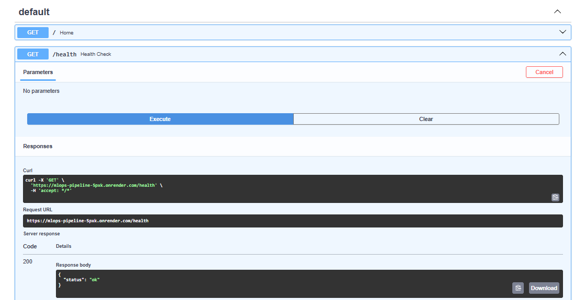
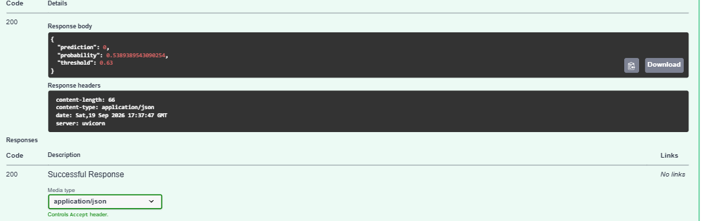
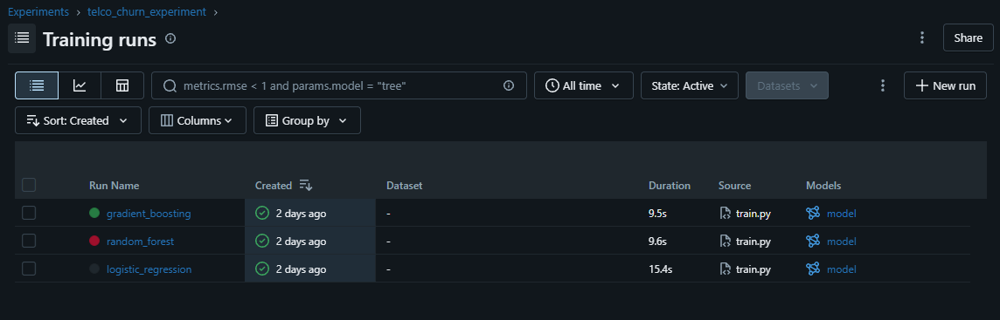
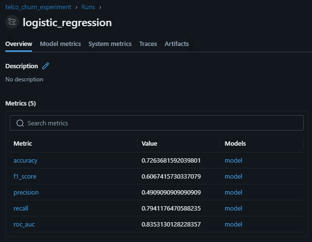
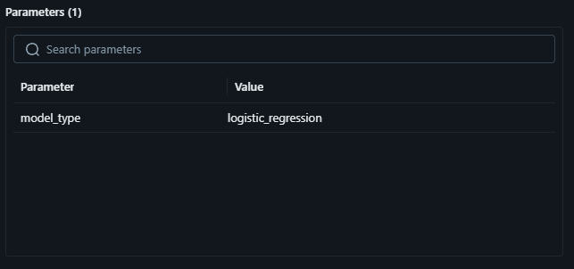
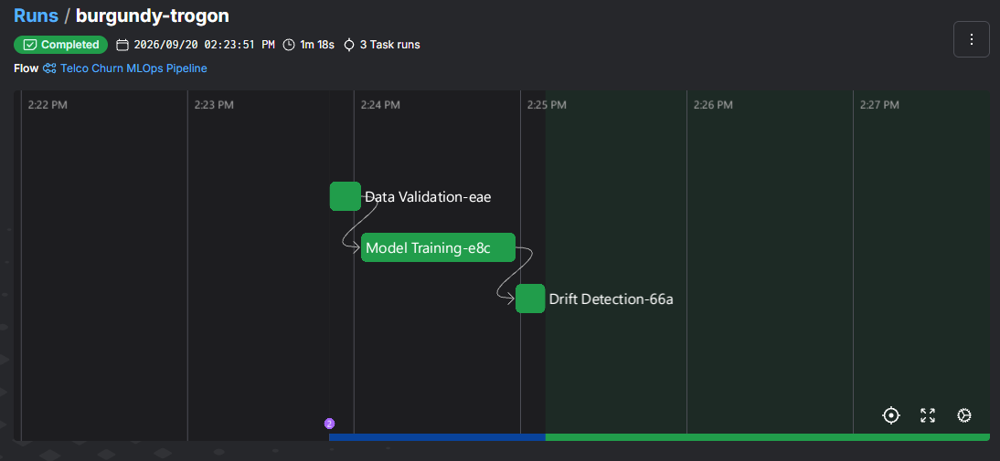
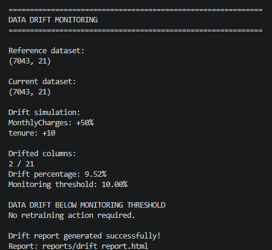
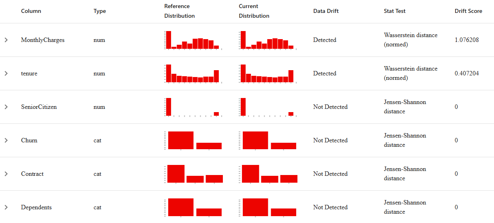

# End-to-End MLOps Pipeline for Telecom Churn Prediction


An end-to-end MLOps project for predicting telecom customer churn, covering the full ML lifecycle: data validation, preprocessing, model training and comparison, classification threshold optimization, experiment tracking, drift monitoring, workflow orchestration, API serving, containerization, CI/CD, and cloud deployment.

## Live Deployment

- **Live API:** https://mlops-pipeline-5pxk.onrender.com/
- **Swagger Docs:** https://mlops-pipeline-5pxk.onrender.com/docs
- **Health Check:** https://mlops-pipeline-5pxk.onrender.com/health
- **Repository:** https://github.com/sujith-psv/mlops-pipeline

The deployed `/predict` endpoint was verified using the trained model and the optimized classification threshold of `0.63`.

---

## Architecture

```text
Telco Churn Dataset
        |
        v
Great Expectations
   (data validation)
        |
        v
Preprocessing
 (encoding + scaling)
        |
        v
Model Training
(Logistic Regression,
 Random Forest,
 Gradient Boosting)
        |
        v
MLflow
(experiment tracking)
        |
        v
Best Model Selected
(Logistic Regression,
 threshold = 0.63)
        |
        v
Evidently
(drift monitoring)
        |
        v
FastAPI
(/health, /predict)
        |
        v
Docker
(~668 MB optimized image)
        |
        v
Render
(cloud deployment)

Prefect
   |
   +---- orchestrates ----> validation -> training -> drift detection
```

---

## CI/CD Pipeline

The project uses GitHub Actions for continuous integration and deployment.

### CI

Every push to `main` and every pull request automatically:

1. Sets up Python 3.10
2. Installs project dependencies
3. Runs automated API tests using Pytest
4. Builds the Docker image

### CD

For pushes to `main`, after the tests and Docker build succeed, GitHub Actions triggers a Render Deploy Hook to deploy the latest version of the API.

### Deployment Flow

```text
Git Push
   |
   v
GitHub Actions
   |
   v
Pytest
   |
   v
Docker Build
   |
   v
Render Deployment
   |
   v
Live FastAPI API
```

---

## Tech Stack

| Category | Technologies |
|---|---|
| Programming Language | Python |
| Machine Learning | Scikit-learn (Logistic Regression, Random Forest, Gradient Boosting) |
| Data Processing | Pandas, NumPy |
| API Framework | FastAPI |
| Experiment Tracking | MLflow |
| Data Validation | Great Expectations |
| Drift Monitoring | Evidently AI |
| Workflow Orchestration | Prefect |
| Containerization | Docker |
| CI/CD | GitHub Actions |
| Cloud Deployment | Render |
| Visualization | Matplotlib, Seaborn |
| Testing | Pytest |

---

## Dataset

IBM Telco Customer Churn dataset:

- 7,043 customer records
- 21 columns including the target and customer identifier
- 19 predictive input features used for training
- Binary target: `Churn`
- `customerID` dropped before training as a non-predictive identifier

---

## Machine Learning

**Preprocessing:** numerical scaling (`StandardScaler`), categorical encoding (`OneHotEncoder`, with unknown-category handling), stratified train/test split, missing-value handling for `TotalCharges`.

**Models compared:** Logistic Regression, Random Forest, and Gradient Boosting — evaluated on accuracy, precision, recall, F1, and ROC-AUC. Logistic Regression and Random Forest use class weighting to address class imbalance.

**Threshold optimization:** the default 0.50 cutoff isn't optimal for an imbalanced problem, so the pipeline sweeps thresholds from 0.20–0.70 and selects the one that maximizes F1. The selected threshold, `0.63`, is used consistently in both evaluation and the live API:

```python
prediction = 1 if churn_probability >= 0.63 else 0
```

### Final Model — Logistic Regression

| Metric | Score |
|---|---:|
| Accuracy | 77.68% |
| Precision | 56.52% |
| Recall | 69.52% |
| F1 Score | 62.35% |
| ROC-AUC | 83.53% |
| Classification Threshold | 0.63 |

Threshold optimization improved F1 over the default 0.50 cutoff.

---

## Data Validation

Great Expectations checks, run before training:

- `tenure` within expected range
- `MonthlyCharges` and `customerID` not null
- `Churn` not null and contains only valid values

```bash
python src/validation/validate_data.py
```

---

## Experiment Tracking

MLflow logs model type, all five metrics, and model artifacts, backed by SQLite (`sqlite:///mlflow.db`).

```bash
mlflow ui
```

---

## Drift Monitoring

Evidently compares a reference dataset against a current dataset at the column level and reports drift percentage. Reports are generated as HTML and saved to `reports/` (git-ignored, since they're generated artifacts).

```bash
python src/monitoring/drift_detection.py
```

---

## Workflow Orchestration

Prefect (`src/pipelines/ml_pipeline.py`) runs validation -> training -> drift detection as a single flow, with explicit task dependencies, retries, and status reporting.

```bash
python src/pipelines/ml_pipeline.py
```

---

## API

FastAPI (`src/api/main.py`) serves the trained model.

**`GET /health`**

```json
{
  "status": "ok"
}
```

**`POST /predict`** — accepts the customer feature fields required by the trained preprocessing pipeline and returns the churn prediction, probability, and classification threshold.

Example live response:

```json
{
  "prediction": 0,
  "probability": 0.5389389543090253,
  "threshold": 0.63
}
```

The predicted churn probability is approximately `0.539`, which is below the `0.63` classification threshold, resulting in `prediction = 0`.

Swagger docs: `/docs` (locally at `http://localhost:8000/docs`, or the live link above).

---

## Docker

The API image uses a dedicated `requirements-api.txt`, excluding MLOps-only dependencies (MLflow, Prefect, Evidently, Great Expectations, Matplotlib, Seaborn) that aren't needed for inference. This cut the image from **1.94 GB to 668 MB (a 66% reduction)**, verified against both `/health` and `/predict` after rebuild.

```bash
docker build -t telco-churn-api .

docker run -d --name telco-churn-api-container -p 8000:8000 telco-churn-api
```

Then open `http://localhost:8000/docs`.

---

## Cloud Deployment

Deployed on Render at https://mlops-pipeline-5pxk.onrender.com/, verified via both the health and prediction endpoints.

---

## Project Structure

```text
mlops-pipeline/
├── data/raw/telco.csv
├── models/churn_pipeline.pkl
├── reports/
├── assets/
│   ├── render_fastapi_health.png
│   ├── render_fastapi_predict.png
│   ├── mlflow_trainingruns.png
│   ├── mlflow_metrics.png
│   ├── mlflow_parameters.png
│   ├── prefect_runs.png
│   ├── drift_detection.png
│   └── drift_graph.png
├── src/
│   ├── __init__.py
│   ├── api/
│   │   ├── __init__.py
│   │   └── main.py
│   ├── monitoring/
│   │   └── drift_detection.py
│   ├── pipelines/
│   │   └── ml_pipeline.py
│   ├── training/
│   │   └── train.py
│   └── validation/
│       └── validate_data.py
├── tests/
│   └── test_api.py
├── .github/
│   └── workflows/
│       └── ci.yml
├── Dockerfile
├── requirements.txt
├── requirements-api.txt
├── pytest.ini
├── .dockerignore
├── .gitignore
└── README.md
```

---

## Running Locally

```bash
git clone https://github.com/sujith-psv/mlops-pipeline.git

cd mlops-pipeline

python -m venv venv

source venv/bin/activate       # Windows: venv\Scripts\activate

pip install -r requirements.txt

python src/validation/validate_data.py    # 1. validate data

python src/training/train.py              # 2. train + select model

python src/monitoring/drift_detection.py  # 3. check drift

python src/pipelines/ml_pipeline.py       # or run steps 1-3 as one Prefect flow

uvicorn src.api.main:app --reload         # 4. serve the API
```

Open `http://localhost:8000/docs`.

### Run Tests

```bash
pytest
```

The API test suite covers:

- Root endpoint
- Health endpoint
- Prediction endpoint
- Prediction response structure
- Probability and threshold validation

---

## Screenshots

### FastAPI API

| Health Endpoint | Prediction Endpoint |
|---|---|
|  |  |

### MLflow

| Training Runs | Metrics |
|---|---|
|  |  |

| Parameters |
|---|
|  |

### Workflow & Monitoring

| Prefect Workflow | Drift Detection |
|---|---|
|  |  |

| Drift Distribution Analysis |
|---|
|  |

---

## Key Learnings

End-to-end ML pipeline design, data quality validation, imbalanced-classification handling, multi-model comparison, classification threshold optimization, experiment tracking, drift monitoring, workflow orchestration, REST API development, Docker image optimization, automated testing, CI/CD, and cloud deployment.

## Future Improvements

- Automated drift-triggered retraining
- MLflow Model Registry
- Kubernetes deployment
- Authentication
- Database integration
- Real-time monitoring dashboards
- Infrastructure-as-Code

---

## Author

**Sujith** — [github.com/sujith-psv](https://github.com/sujith-psv)

## License

Intended for educational and portfolio purposes.